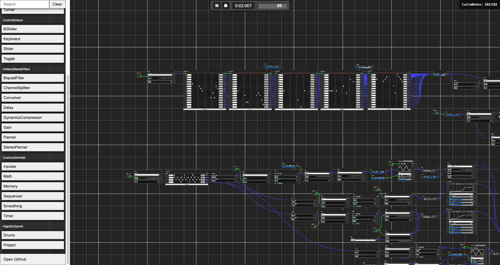
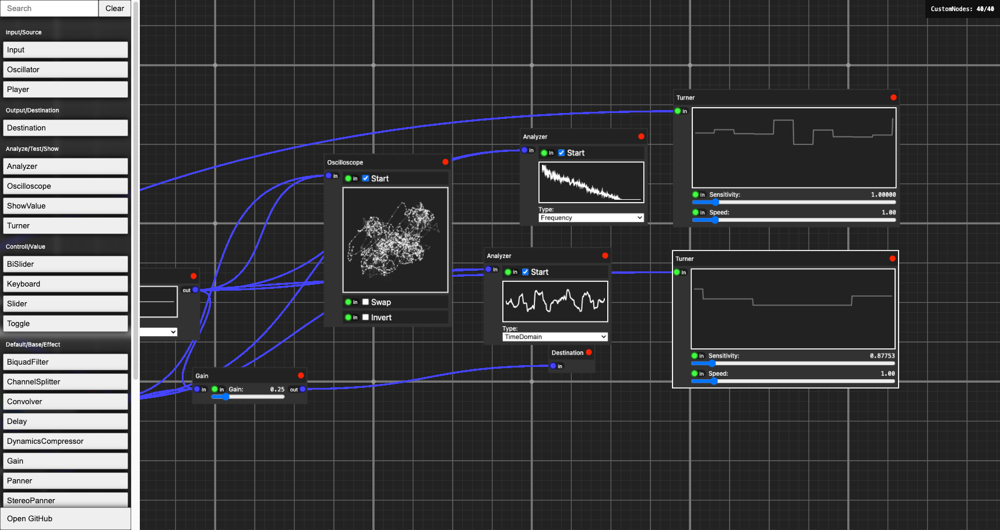

# WebAudioNodes Sandbox

**WebAudioNodes Sandbox** — это визуальный конструктор аудио-графов на WebAudio API. Проект позволяет собирать, настраивать и запускать собственные аудио-схемы из готовых узлов (нод), таких как генераторы, фильтры, эффекты, секвенсоры, анализаторы и многое другое. Интерфейс реализован в виде node-based редактора, где можно перетаскивать и соединять блоки, настраивать параметры и управлять воспроизведением.

## Скриншоты

> 
>
> 
>
> 
>
> 

## Основные возможности

- **Node-based редактор**: визуальное создание и соединение аудио-узлов.
- **Большой набор узлов**: генераторы, эффекты, анализаторы, секвенсоры, математика, обработка сигналов, работа с микрофоном и файлами.
- **Группировка узлов**: все ноды разбиты на категории для удобного поиска.
- **Гибкая настройка параметров**: у каждого узла есть свои контролы.
- **Управление проектом**: запуск/стоп, темп, таймер, секвенсор.
- **Импорт/экспорт проектов**: поддержка копирования/вставки проектов через буфер обмена.
- **Воспроизведение и запись**: работа с микрофоном, файлами, секвенсорами.

## Типы узлов

- **Input/Source**: Oscillator, Input (микрофон), Player (аудиофайл)
- **Output/Destination**: Destination (выход)
- **Analyze/Test/Show**: Analyzer (спектр), Oscilloscope (осциллограф), ShowValue
- **Controll/Value**: Keyboard, ProjectValue, Timer, Toggle, Slider, Memory
- **Default/Base/Effect**: Gain, Delay, BiquadFilter, Convolver, DynamicsCompressor, Panner, StereoPanner, ChannelSplitter, Smoothing
- **Custom/Worklet**: Math, Inpulse, Seqencer (секвенсор), Drums, Turner и др.

## Порты: AudioPort и SignalPort

В проекте используются два типа портов для соединения узлов:

- **AudioPort** — передаёт аудиосигнал (обычно стерео). Используется для передачи звука между узлами, такими как генераторы, эффекты, выходы. **Обозначается синим цветом.**
- **SignalPort** — передаёт управляющие или модульные сигналы (только моно). Используется для управления параметрами, модуляции, передачи значений между контроллерами и генераторами. **Обозначается зелёным цветом.**

### Совместимость и особенности
- **AudioPort** и **SignalPort** можно соединять между собой, если это поддерживается логикой узлов.
- **AudioPort** может быть полигамным (допускает несколько входов/выходов), а **SignalPort** чаще моногамен (только одно соединение).
- В **AudioPort** может передаваться стерео-звук, в **SignalPort** — только моно-сигнал (например, для управления частотой, громкостью и т.д.).
- При проектировании графа учитывайте, что не все комбинации портов имеют смысл: управляющие сигналы не всегда можно напрямую подать в аудио-эффекты и наоборот.

## Как пользоваться

1. **Запуск**:  
   - `npm install`
   - `npm run dev`
   - Откройте [http://localhost:5173](http://localhost:5173) в браузере.

2. **Добавление узлов**:  
   - В левом меню выберите нужный узел (можно искать по названию).
   - Перетащите его на рабочее поле или кликните для добавления.
   - Соединяйте порты узлов для построения аудио-графа.

3. **Управление проектом**:  
   - В верхней панели: запуск/пауза (пробел), стоп, изменение темпа.
   - Некоторые проекты можно вставить из буфера обмена (см. ниже).

4. **Импорт/экспорт**:  
   - [Тут](https://drive.google.com/drive/folders/1L9rbsji8xAWgx-6N4uCMX2BMtWbhR34m) лежат примеры проектов. Скопируйте содержимое файла и вставьте на сайт — проект загрузится автоматически.

5. **Горячие клавиши**:
   - Пробел — запуск/пауза проекта.
   - Enter — подтверждение ввода параметра.

## Установка и запуск

```bash
git clone https://github.com/vicimpa/w-nodes.git
cd w-nodes
npm install
npm run dev
```

Откройте [http://localhost:5173](http://localhost:5173) в браузере.

## Архитектура

- **src/components/audio-context/** — все аудио-узлы, логика работы с WebAudio API, меню, контролы.
- **src/components/node-editor/** — визуальный редактор, отрисовка, взаимодействие, слои, линии, выбор, перемещение.
- **src/App.tsx** — точка входа, инициализация редактора и аудио-контекста.
- **src/index.html** — HTML-шаблон приложения.

## Зависимости

- React, styled-components, @preact/signals-react
- Vite (dev server)
- Собственные библиотеки для drag-n-drop, декораторов, сигналов и т.д.

## Лицензия

MIT License